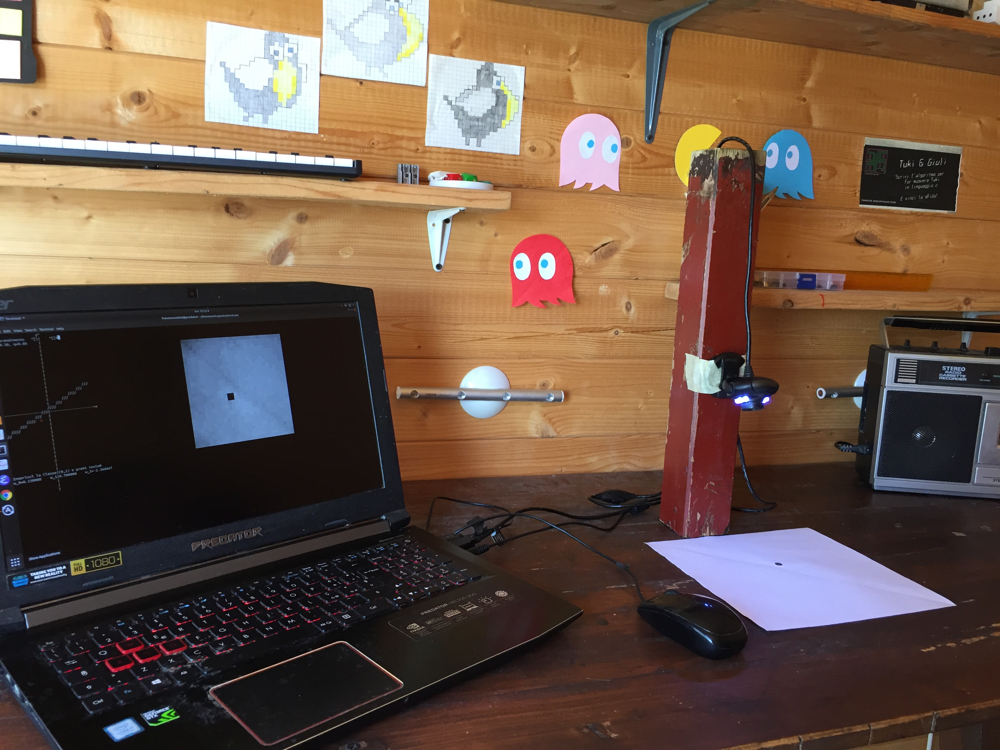

# Camera neurale
Il nome del progetto deriva dall'aver usato una webcam per acquisire in realtime delle immagini usate per addestrare e testare le nostre reti neurali
<br>
Il progetto [rete_1s](rete_1s) consiste nell'addestrare  una rete ad un solo strato a classificare la posizione di un **tag** sul piano

Il progetto [rete_2s](rete_2s) consiste nell'addestrare  una rete che usa due srati di percettroni per classificare le cifre da 1 a 5 scritte a mano a acquiste con la webcam
## Compilazione 
- Scarica o clona il progetto: ```$ git clone https://github.com/francescosisini/camera_neurale.git`
- Entra in ```rete_1s``` o in ```rete_2s```: ```$ cd rete_1s```
- Segui il README che si trova nella cartella

<div>

</div>
<div>

</div>
