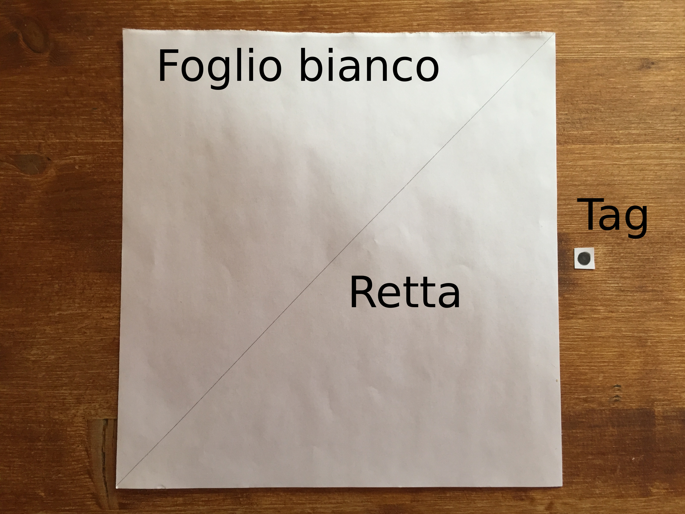
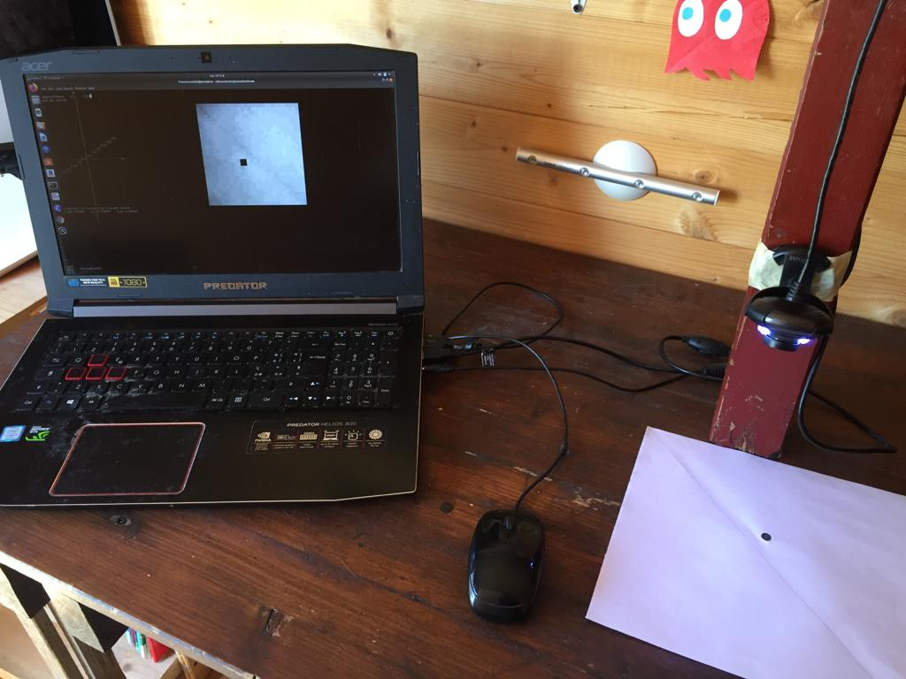

# Istruzioni
Per eseguire l'esperimento di addestramento della rete neurale si deve prearare una piccola postazione sperimentale seguendo le istruzioni:
- preparare un foglio di carta bianco con disegnata una retta a matita, o comunque con un segno leggero
- Creare il **tag** colorando di nero un quadratino di 1 cm<sup>2</sup> circa (vedi figura)
- Posizionare la webcam in modo che inquadri il foglio di carta dall'alto (vedi figura)
- Posizionare il **tag** sul foglio
- Eseguire ```$ ./rete_1s /dev/video0``` dove al posto di ``` /dev/video0``` va specificato il device video della webcam desiderata, visibile con ```$ ls /dev/video*```
- Premere `Invio` per scattare la prima foto
- Digitare la classe dell'immagine 1 o 0 in base alla posizione (sopra o sotto) del **tag** rispetto alla retta e premere `Invio`
- Ripetere la procedura finché sul monitor in alto a sinistra compare la scritta `Test`
- Spostare il **tag** a piacere, premere `Invio` e verificare la corretta classificazione




